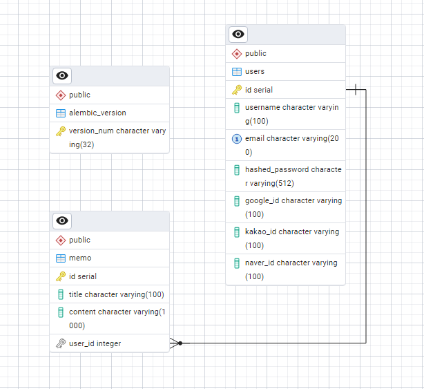

# 📝 FastAPI 기반 메모 웹 애플리케이션

**회원 가입부터 소셜 로그인, 사용자별 메모 관리까지 구현한 FastAPI 기반 웹 애플리케이션입니다.**  
비동기 처리, 세션 인증, MVC 패턴 적용 등 실제 서비스 수준의 기능을 학습하고 구현했습니다.

> ⏱️ 프로젝트 기간: 2025년 5월 9일 ~ 2025년 5월 19일  
> 🛠️ 주요 언어: `FastAPI`, `Python`, `PostgreSQL`, `HTML`, `Jinja2`, `JavaScript`, `CSS`

---

## 🚀 주요 기능

| 기능 구분 | 상세 내용 |
|----------|-----------|
| 👤 **회원 관리** | - 회원 가입, 로그인, 로그아웃, 회원 탈퇴<br>- 아이디 찾기, 비밀번호 변경/임시발급 |
| 🔐 **소셜 로그인** | - 구글 / 네이버 / 카카오 OAuth2 연동<br>- 소셜 계정 로그인 및 탈퇴 처리 |
| 🗒 **메모 관리** | - 메모 생성, 조회, 수정, 삭제 (CRUD)<br>- 사용자별 메모만 조회 가능 |
| 📬 **이메일 발송** | - 가입, 탈퇴, 아이디/비밀번호 찾기 등 자동 이메일 전송 |
| ⏳ **자동 로그아웃** | - 비활동 시 자동 로그아웃 타이머 설정 및 표시 |

---
## 📌 기술 스택 뱃지


---

## 🧰 사용 기술 스택

| 분야 | 기술 |
|------|------|
| **백엔드** | FastAPI, Python, SQLAlchemy, Alembic |
| **프런트엔드** | HTML, CSS, JavaScript, Jinja2 |
| **데이터베이스** | PostgreSQL |
| **인증** | OAuth2 (구글, 카카오, 네이버), SessionMiddleware |
| **비밀번호 해시** | passlib, bcrypt |
| **이메일 발송** | Gmail SMTP, email.message |
| **백그라운드 작업** | FastAPI BackgroundTasks |
| **환경 변수 관리** | python-dotenv |
| **HTTP 클라이언트** | httpx, authlib |

---

## 📦 ERD (Entity Relationship Diagram)



---

## 📂 디렉터리 구조

```bash
📁 프로젝트 구조
├── controllers/
│   ├── main_controller.py
│   ├── memos_controller.py
│   └── users_controller.py
├── oauth/
│   ├── google.py
│   ├── kakao.py
│   ├── naver.py
│   └── unlink_services.py
├── service/
│   ├── email_class.py
│   └── email_service.py
├── templates/
│   ├── login.html
│   ├── signup.html
│   ├── memos.html
│   ├── change_pw.html
│   ├── find_account.html
│   └── ...
├── .env
├── alembic.ini
├── database.py
├── dependencies.py
├── main.py
├── models.py
├── schemas.py
├── requirements.txt
└── run.bat
```

---

## 📖 프로젝트 목표 및 학습 과정

- ✅ FastAPI + PostgreSQL을 활용한 CRUD 구현
- ✅ 사용자 인증 시스템 구현 (Session 기반 인증)
- ✅ MVC 패턴 기반 프로젝트 구성
- ✅ OAuth2 기반 소셜 로그인 구현
- ✅ 사용자별 데이터 분리 및 보안 처리
- ✅ 백엔드와 프런트엔드 연동 경험
- ✅ Alembic을 통한 DB 마이그레이션 실습
- ✅ BackgroundTasks를 이용한 비동기 이메일 전송
- ✅ JavaScript 기반 UI 개선 및 자동 로그아웃 타이머 구현

---

## 🧠 참고 도서

- 《가장 빠른 풀스택을 위한 플라스크 & FastAPI》
- 《FastAPI로 배우는 백엔드 프로그래밍 with 클린 아키텍처》

---

## 📝 개발 기록 (블로그 제작기)

| 주제 | 링크 |
|------|------|
| 🔧 초기 설정 및 DB 연동 | [바로가기](https://puppy-foot-it.tistory.com/836) |
| ✍ CRUD 구현 (메모) | [바로가기](https://puppy-foot-it.tistory.com/837) |
| 🧑‍💻 사용자 인증 | [바로가기](https://puppy-foot-it.tistory.com/838) |
| 🧾 사용자별 메모 및 Alembic | [바로가기](https://puppy-foot-it.tistory.com/839) |
| 🧪 웹페이지 개선 | [바로가기](https://puppy-foot-it.tistory.com/840) |
| 🎨 프론트엔드 + 자바스크립트 | [바로가기](https://puppy-foot-it.tistory.com/841) |
| 🔒 ID/PW 규칙 설정 및 예외 처리 | [바로가기](https://puppy-foot-it.tistory.com/842) |
| 🧱 MVC 패턴 적용 | [바로가기](https://puppy-foot-it.tistory.com/843) |
| 🔐 소셜 로그인 (구글/카카오/네이버) | [구글](https://puppy-foot-it.tistory.com/844) / [카카오](https://puppy-foot-it.tistory.com/845) / [네이버](https://puppy-foot-it.tistory.com/846) |
| 📬 환영 메일 및 이메일 기능 보완 | [이메일 발송](https://puppy-foot-it.tistory.com/847) / [보완](https://puppy-foot-it.tistory.com/853) |
| 🧹 코드 정리 및 파일 분할 | [바로가기](https://puppy-foot-it.tistory.com/850) |
| 🔍 아이디 찾기 / 비밀번호 찾기 | [ID](https://puppy-foot-it.tistory.com/851) / [PW](https://puppy-foot-it.tistory.com/852) |
| 🖥 메인 페이지 구성 | [바로가기](https://puppy-foot-it.tistory.com/854) |
| 🔓 소셜 계정 탈퇴 처리 | [바로가기](https://puppy-foot-it.tistory.com/855) |
| ⏱ 자동 로그아웃 타이머 구현 | [바로가기](https://puppy-foot-it.tistory.com/861) |

---

## 🧭 향후 계획 (Roadmap)

-   [ ] **관리자 모드 도입:** 관리자 모드를 도입하여 관리자가 사용자의 모든 컨텐츠를 관리할 수 있도록 개선
-   [ ] **대시보드 적용:** 사용자의 활동을 기록하고 보여줄 수 있는 대시보드 도입
-   [ ] **사용자 맞춤형 테마 및 UI 설정:** 다크 모드 지원, 글꼴 크기 조절 등 개인화 옵션 제공
-   [ ] **메모 분류 및 태그 기능**: 메모별로 카테고리 분류 또는 태그를 달아 관리가 쉽도록 개선 / 태그별 검색 및 필터링 기능 추가
-   [ ] **다양한 미디어 첨부 지원**: 텍스트뿐 아니라 이미지, 파일, 음성 메모 등 다양한 형태의 메모 작성 지원
-   [ ] **CI/CD**: 실제 사용자를 위한 클라우드 서버로의 배포 및 자동화된 배포 파이프라인 구축
---


## 📜 라이선스 (License)

이 프로젝트는 [MIT License](LICENSE) 를 따릅니다.
